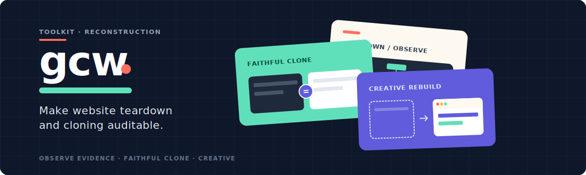
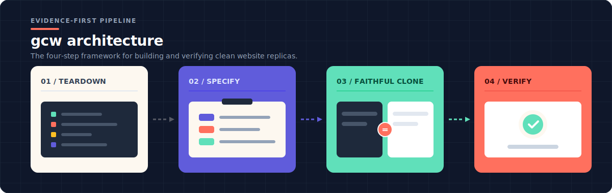
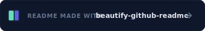

# GCW

<div align="center">

[English](./README.md) · [简体中文](./README.zh-CN.md)

**Evidence-driven website teardown, faithful cloning, and creative reconstruction.**

<p align="center">
  
</p>

[](https://github.com/idonafraid-create/GCW/actions/workflows/ci.yml)
[](./LICENSE)
[](https://github.com/idonafraid-create/GCW/releases/latest)

</div>

GCW is an agent skill and toolkit for reconstructing authorized public websites from runtime evidence. It turns routes, interaction states, responsive behavior, assets, and GPU rendering into an auditable specification before implementation begins.

The result can be a technical teardown, a runnable replay, or an editable faithful clone with a clear path to post-review creative work.

> A screenshot is one frame. A live website is a million.

GCW stands for Gao Copy Website. Yes, the name is that literal.

<p align="center">
  
</p>

A screenshot captures one frame. A faithful reconstruction must also explain what happens across routes, breakpoints, hover and focus states, loading transitions, external data, and WebGL or shader pipelines.

GCW keeps three things separate:

- **Evidence** — what was actually observed.
- **Faithful implementation** — what reproduces the approved baseline.
- **Creative work** — what may change only after that baseline passes review.

This separation makes visual similarity testable and prevents a production bundle replay from being mistaken for maintainable source.

<p align="center">
  
</p>

### 1. Install

Clone GCW into a stable location, then link it into your agent's skill directory:

```powershell
git clone https://github.com/idonafraid-create/GCW.git D:\path\to\GCW
New-Item -ItemType Junction `
  -Path D:\path\to\.agent\skills\gcw `
  -Target D:\path\to\GCW
```

On macOS or Linux, use a symbolic link instead:

```bash
ln -s /path/to/GCW /path/to/.agent/skills/gcw
```

Install and check the toolkit:

```bash
npm ci
npm run install:browser
python -m pip install -r requirements.txt
npm run check
```

Requirements: Node.js 20+, Python 3.10+, Chromium installed through Playwright, and [design-dna](https://github.com/zanwei/design-dna) installed at `.agent/skills/design-dna`. Design DNA is required for every teardown depth, including `minimal`. For Canvas/WebGL/WebGPU/shader targets, also install [web-shader-extractor](https://github.com/lixiaolin94/skills/tree/main/web-shader-extractor) at `.agent/skills/web-shader-extractor` and run `npm run check:gpu`.

### 2. Ask for an outcome

Examples:

```text
Use GCW to analyze this authorized site and produce a technical teardown only.

Use GCW to build an editable faithful clone of this authorized site.

Use GCW to build an editable faithful clone, review it with me, then continue with approved creative changes.
```

Before build work starts, GCW asks you to choose the final delivery contract. It does not choose for you:

| Choice | Final deliverable | Editability target |
|---|---|---|
| **A** | Research or runnable replay only | Runnable replay |
| **B** | Editable faithful clone | Maintainable source |
| **C** | Editable faithful clone, then Creative after review | Maintainable source |

Choosing B does not lock you out of Creative. You can explicitly upgrade to C at the review gate or resume Creative later from an accepted B delivery.

## What you get

<p align="center">
  
</p>

Depending on scope, GCW leaves behind:

- a finalized `SITE_SPEC.md` tied to captured evidence;
- route, interaction, responsive, asset, network, and GPU inventories;
- source-versus-local visual regression results;
- an implementation decision trail with provenance and known gaps;
- for B/C, a maintainable source entrypoint, `REPLACE_GUIDE.md`, and editability evidence.

`ARTIFACT_REPLAY` may be used as an oracle, but it cannot pass a B/C delivery gate as the final candidate.

<p align="center">
  
</p>

```text
TEARDOWN_PHASE -> FAITHFUL_CLONE -> REVIEW_GATE -> CREATIVE_REBUILD
```

1. **Observe** routes, states, assets, rendering systems, and reuse constraints.
2. **Specify** the baseline and label conclusions as source, partial, or guess.
3. **Reconstruct** through source adaptation, a clean rebuild, or authorized production recovery.
4. **Verify** builds, routes, responsive states, runtime independence, and visual diffs before review.

When production recovery is required, `MAINTAINABLE_REBUILD` is the formal strategy for turning recovered evidence into maintainable source.

For visual-system analysis, GCW integrates [design-dna](https://github.com/zanwei/design-dna). GPU targets additionally require [web-shader-extractor](https://github.com/lixiaolin94/skills/tree/main/web-shader-extractor). Their native evidence remains authoritative; GCW coordinates it rather than duplicating it.

<p align="center">
  
</p>

| Need | Start here |
|---|---|
| Full agent workflow | [SKILL.md](./SKILL.md) |
| Clone modes and A/B/C contracts | [references/clone-modes.md](./references/clone-modes.md) |
| Phase and delivery gates | [references/gates.md](./references/gates.md) |
| Site specification | [references/site-spec.md](./references/site-spec.md) |
| Recovery strategies | [references/recovery-tiers.md](./references/recovery-tiers.md) |
| Runtime independence | [references/runtime-independence.md](./references/runtime-independence.md) |
| Tool and script reference | [references/tooling.md](./references/tooling.md) |
| QA scenarios | [references/qa-scenarios.md](./references/qa-scenarios.md) |

Run the complete repository gate with:

```bash
npm run verify
```

## Safety and reuse

Use GCW only for sites you own, license, or have explicit authorization to reconstruct. Private or authenticated content is out of scope unless separately authorized. Code, fonts, images, models, data, and branding must each be reviewed for reuse rights.

GCW records evidence and uncertainty; it does not turn deployed artifacts into presumed original source.

## Acknowledgments

GCW builds on ideas and tooling from [design-dna](https://github.com/zanwei/design-dna), [web-shader-extractor](https://github.com/lixiaolin94/skills/tree/main/web-shader-extractor), and [Playwright](https://playwright.dev/).

<p align="center">
  <a href="https://github.com/oil-oil/beautify-github-readme">
    
  </a>
</p>

## License

[MIT](./LICENSE)
