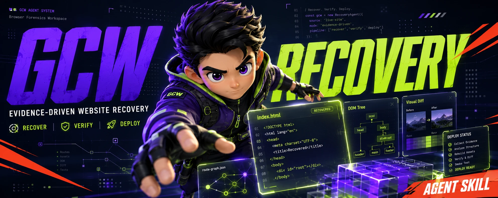
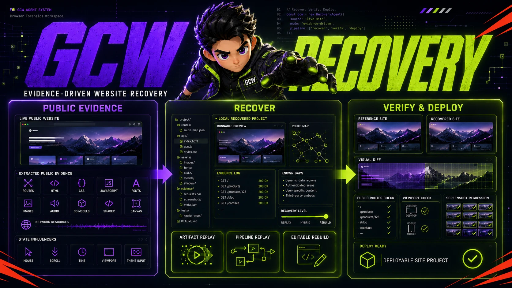

# GCW

以证据驱动的网站复刻、技术拆解与创意重建工具。

<p align="center">
  <a href="./README.md">English</a> · <strong>简体中文</strong>
</p>



[](./LICENSE)

看到一个值得学习的网站，想知道它到底是怎么实现的，或者把关键效果复刻成可运行、可修改的本地项目？GCW 会先寻找真实源码和公开运行证据，再选择合适的复刻路径，并在真实浏览器中验证结果。

GCW 不会把看起来合理的 AI 推测当成真实实现，也不会把线上压缩产物冒充成原始工程源码。参考证据、推断结果和你的可编辑实现会被清楚区分。

> 先找证据，再实现；先跑通，再重构；先对照，再美化。

## 你可以用 GCW 做什么

| 目标 | 得到什么 |
|---|---|
| 学习优秀网站 | 有证据支撑的技术拆解和可迁移方法 |
| 忠实复刻网站 | 可本地运行，并经过路由、响应式、交互和视觉检查的项目 |
| 改造成自己的版本 | Design DNA、替换指南和原创的可编辑实现 |
| 恢复自有生产站 | 源码不可用时的已验证回放或可维护重建 |

GCW 可处理静态页面、React/Vue/Next 内容站、多页面官网、动画型品牌站，以及 Canvas、WebGL、WebGPU 重前端网站。登录、私有服务端逻辑、支付、权限和专有 API 默认不在范围内。

普通网站是 GCW 的正式适用场景，不是次要兼容项。GCW 的差异化在于：同一套流程还能继续处理复杂动效、交互状态和 GPU 渲染，并保持证据记录与浏览器验证。

## GCW 怎样工作

```text
TEARDOWN_PHASE -> FAITHFUL_CLONE -> REVIEW_GATE -> CREATIVE_REBUILD
```

所有任务先完成拆解并生成 `.gcw/SITE_SPEC.md`；只研究可在此停止。构建任务先建立约定范围内的忠实基线，再停在 `REVIEW_GATE`，由用户决定继续提高忠实度、接受复刻结果，或批准创意重建。

| 用户结果 | 流程 | 实现路径 |
|---|---|---|
| 研究站点 | 在 `TEARDOWN_PHASE` 后停止 | 仅证据 |
| 忠实结果 | 进入 `FAITHFUL_CLONE`，然后评审 | `SOURCE_ADAPT` 或 `CLEAN_REBUILD` |
| 创意结果 | 先接受忠实基线，再生成创意 Brief | 基线路径，然后原创实现 |
| 恢复自有且源码不可用的网站 | 在忠实阶段启用恢复配置 | `PRODUCTION_RECOVERY` 配置 |



## 证据编排：GCW 的核心差异

GCW 不只是调用兄弟 Skill。它保留兄弟 Skill 的原生证据，把分析结果汇总为唯一实施规格，并在证据契约通过前阻止阶段切换。

### 兄弟 Skill 分析

每次 `TEARDOWN_PHASE` 都必须在 `SITE_SPEC.md` 定稿前运行 `design-dna`，只做研究也不例外：

- [design-dna](https://github.com/zanwei/design-dna)：强制提取字体、间距、配色、布局、响应式、动效和视觉语言。
- [web-shader-extractor](https://github.com/lixiaolin94/skills/tree/main/web-shader-extractor)：检测到 Canvas、WebGL、WebGPU 或 Shader 时强制分析；不存在 GPU 渲染面时必须用检测证据标记 `N/A`。

请把两者安装到同一个单数 `.agent/skills` 根目录。只做研究会在拆解后停止，但不得绕过拆解阶段的必需分析。

### 每一层只有一个权威来源

| 层级 | 权威来源 |
|---|---|
| 兄弟 Skill 原生产物 | 完整 Design DNA 与 Shader 证据 |
| `SITE_SPEC.md` | 唯一的人类可读实施规格 |
| `teardown-manifest.json` | 机器可读的拆解完成 Gate |
| `evidence-index.json` | Artifact 路径、归属和 SHA-256 checksum |

```text
.gcw/
├─ SITE_SPEC.md
├─ teardown-manifest.json
├─ run-state.json
└─ evidence/
   ├─ evidence-index.json
   ├─ site-inventory.json
   ├─ route-map.json
   ├─ interaction-states.json
   ├─ screenshots/{desktop,mobile}/
   ├─ network/
   ├─ design-dna/design-dna.json
   └─ web-shader-extractor/
      ├─ gpu-decision.json
      ├─ scout-card.json          # 仅 GPU 目标
      └─ replay-manifest.json     # 仅 GPU 目标
```

当固定证据为空、Design DNA 缺失、GPU `N/A` 没有检测证据，或已发现的 GPU 目标尚未达到 `TARGET_LOCKED` 与 `REPLAY_READY` 时，`finalize_teardown.py` 会拒绝定稿。GCW 只在 SITE_SPEC 中汇总和引用这些产物，绝不复制或改写兄弟 Skill 的原生 schema。

## 快速开始

### 1. 安装 GCW

把本仓库克隆为唯一源码：

```bash
git clone https://github.com/idonafraid-create/GCW.git /path/to/GCW
```

然后把它链接到当前工作区使用的单数目录 `.agent/skills`。

Windows PowerShell：

```powershell
New-Item -ItemType Junction `
  -Path "D:\your-workspace\.agent\skills\gcw" `
  -Target "D:\path\to\GCW"
```

macOS 或 Linux：

```bash
ln -s /path/to/GCW /path/to/your-workspace/.agent/skills/gcw
```

### 2. 检查工具环境

```bash
cd /path/to/GCW
npm install
npm run install:browser
python -m pip install -r requirements.txt
npm run check
```

`npm run check` 只检查运行依赖和配套 Skill 是否可发现。环境检查通过，不代表某个具体复刻项目已经完成。

发布 GCW 自身改动前，运行完整发布验证：

```bash
npm run verify
```

它会执行语法检查、本地 HTTP/Chromium 工作流测试、URL 与凭证边界测试、图像 Diff 门禁、CI 安装器测试和环境检查。

### 3. 直接说出你想要的结果

```text
使用 $gcw 学习这个网站，确认它的真实实现，并输出技术拆解：https://example.com/
```

```text
使用 $gcw 忠实复刻这个经过授权的公开网站，做成可运行的本地项目：https://example.com/
```

```text
使用 $gcw 提取这个参考站的 Design DNA，再换成我的内容重新实现：https://example.com/
```

GCW 会先做一次简短预判，再决定工具、路径和交付范围。

## GCW 可以留下哪些成果

- `.gcw/SITE_SPEC.md` 与固定的路由、交互、网络和截图证据
- `teardown-manifest.json` 与带 checksum 的证据索引
- Design DNA 原生产物，以及按条件生成的 Shader Target Lock/Replay Ready 产物
- 路由与资源盘点结果
- 可运行的本地项目和生产构建命令
- `CLONE_REPORT.md`：原站与本地实现的差异、取舍和已知缺口
- `REPLACE_GUIDE.md`：文字、媒体、配色、字体、模型和数据替换位置
- 桌面端和移动端对照截图、数值 Diff 和可视化报告
- 可选的 GitHub Actions 截图回归

只有在确认所有权/授权且可维护源码不可用时，才启用生产恢复的来源链和 Replay 文档。

## 工具清单

| 脚本 | 用途 |
|---|---|
| `init_reconstruction.py` | 建立非破坏性的 `.gcw/` 项目记录 |
| `finalize_teardown.py` | 校验兄弟 Skill 产物并定稿 SITE_SPEC |
| `site_inventory.mjs` | 盘点公开路由、资源、字体和渲染区域 |
| `capture_compare.mjs` | 在一致条件下截取源站和本地版本状态 |
| `batch_image_diff.py` | 生成指标、Diff 图和 Markdown/JSON 报告 |
| `route_smoke.py` | 检查预览路由与代表性文字 |
| `install_ci.py` | 安装 GCW 视觉回归 Runner 和工作流 |
| `advance_workflow.py` | 记录合法的阶段与评审门转换 |
| `download_assets.py` | 按清单可重复下载已授权资产 |
| `check_runtime_independence.py` | 阻止未声明的源站运行时请求 |
| `blender_replace_text.py` | 可选：处理已烘焙进 GLTF/GLB 几何体的文字 |

Agent 完整流程见 [SKILL.md](./SKILL.md)。[references](./references/) 中定义了阶段、SITE_SPEC、资产来源、运行时独立性、生产恢复、QA、工具和专项情况。

## 视觉验证

定义源站和本地版本的对照场景，然后捕获并比较一致状态：

```bash
node scripts/capture_compare.mjs \
  --config /project/.gcw/capture-scenarios.json \
  --output /project/.gcw/results

python scripts/batch_image_diff.py \
  /project/.gcw/results \
  --diff-dir /project/.gcw/results/diff
```

GCW 可以对齐随机种子、JavaScript 时间、视口、DPR、路由、鼠标位置、滚动和页面就绪条件。GPU 驱动、视频、跨域 iframe、Worker 和合成器时序仍可能产生噪声；应单独记录这些区域，而不是放宽全部阈值。

## 环境要求

- Python 3.10+
- Node.js 20+
- Pillow
- Playwright 和 Chromium
- Blender 4.x，仅用于可选的 3D 烘焙文字专项流程

## 安全与复用边界

目标网站必须属于用户、具有符合用途的许可证，或者已经获得明确授权。

- 不绕过登录、密码、付费墙或其他访问控制。
- 使用最终规范 URL；包含凭证的 URL 和离开配置 Origin 的文档重定向会在浏览器捕获前被拒绝。
- 对外发布前，分别检查代码与图片、字体、模型等素材的许可。
- 创意重建版本应移除追踪脚本和原站品牌残留。
- 不提交线上 Bundle 或配置中暴露的凭证。
- 在需要区分确定性时，用 `SOURCE`、`PARTIAL`、`GUESS` 标记技术结论。

## 致谢

GCW 的首个网站复刻基准与生产恢复案例以 [haoqi.design](https://haoqi.design/) 作为公开参考站点。感谢原作者 Haoqi Wen，他的作品为路由恢复、WebGL 取证、确定性视觉对比和 3D 烘焙文字专项提供了真实验证场景。GCW 是独立项目；此处致谢用于说明案例来源，并不表示他参与或维护本仓库。

GCW 会协调独立维护的 `web-shader-extractor` 与 `design-dna` 工作流，但不打包它们的源码。许可证和最新更新以各自上游仓库为准。

## 许可证

GCW 使用 [MIT License](./LICENSE)。
